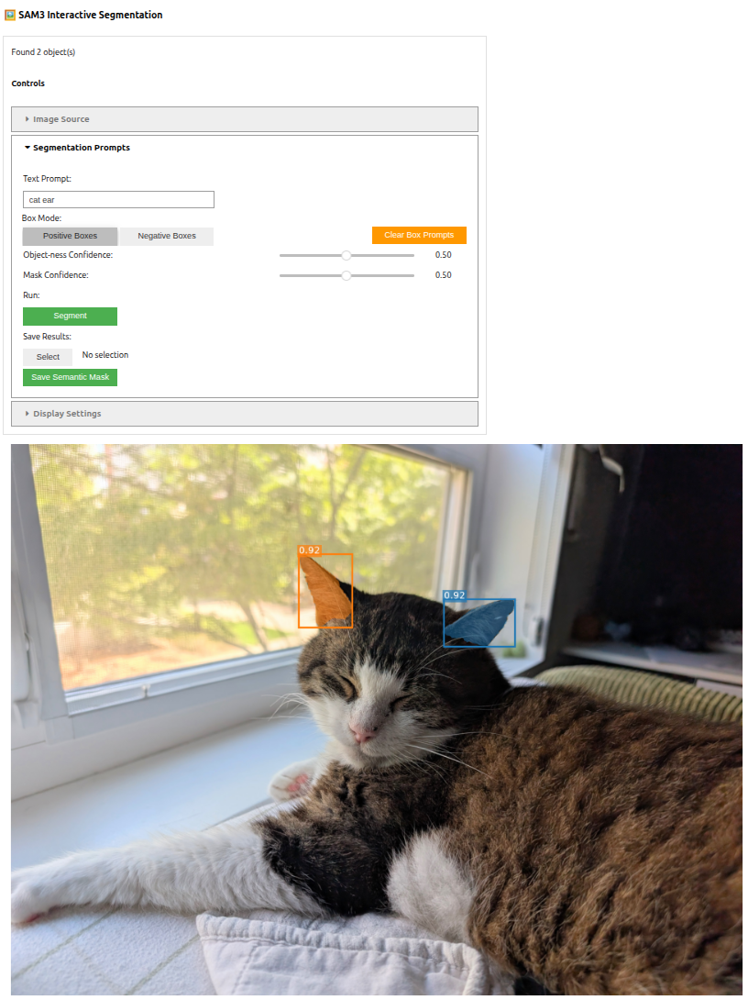

# SAM3 Demo
An interactive demo of SAM3, which performs promptable concept segmentation using text prompts and bounding boxes. This demo can be run within a jupyter notebook. It is recommended but not required to use a GPU.

- Input image: can use a local file or URL to locate an image online. Only one image can be run at a time. Image embeddings are stored and reused with new prompts to prevent extra computation.
- Text prompts: a descriptive noun phrase for what the model should segment
- Bounding boxes: a box draw onto the image. This can be a positive or negative example

# Install

## Prerequisites
- Python 3.12 or higher
- Access to Meta's SAM3 gated repository on HuggingFace (requested via visiting the repo and filling out their form)
- Access tokens: HuggingFace

A GPU is not required, but is recommended.

## Environment Setup
### UV install
While not required, uv is a useful package manager that enables fast setup. See https://docs.astral.sh/uv/getting-started/installation/#standalone-installer

First, sync most of the packages by running
```
uv synch
```

After syncing, install pytorch with automatic version detection using
```
uv pip install torch torchvision --torch-backend=auto
```
To select a specific version instead, use
```
uv pip install torch torchvision --torch-backend=cu130
```
where "cu130" is for CUDA v13.0, as an example.

### Non-UV install
For other package managers, use the included pyproject.toml for requirements. See https://pytorch.org/get-started/locally/ for instructions on downloading the correct Pytorch version.

## Huggingface setup w/ SAM3
1. Request access to the SAM3 model on HuggingFace: https://huggingface.co/facebook/sam3
2. Create a HuggingFace read access token (login > Settings > Access Tokens)
3. Create the file .env in the same directory as main.ipynb. Populate this with:
```
HF_TOKEN=<your access token string>
```
4. Wait until access is granted, which is typically less than 1 day

# Run

Run all cells of main.ipynb to spawn the demo. Prompts, desired confidence thresholds, and query image can be changed via the UI.




# Acknowledgements
The underlying model SAM3 was created by Meta. This script is a modification of their example script "/sam3/examples/sam3_image_interactive.ipynb" which uses HuggingFace's transformer library instead of referencing the repo 
